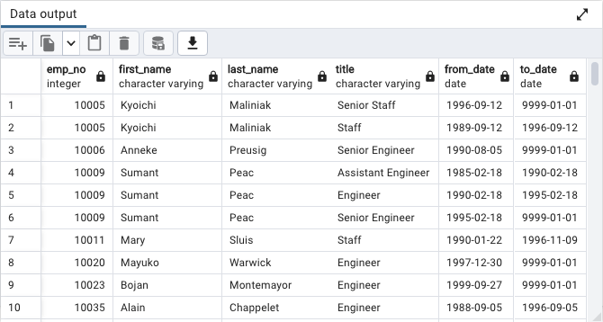
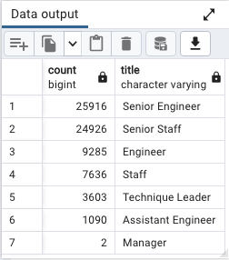
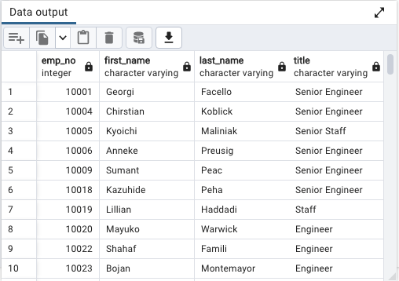
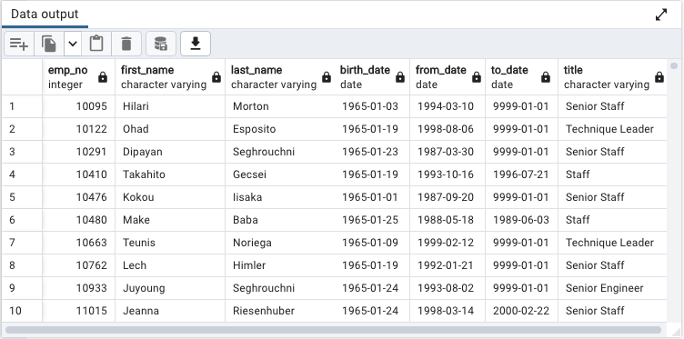

# Pewlett-Hackard-Analysis

# Overview

The baby boomers are set to retire soon in a relatively short time frame. This mass retirement is being called the "silver tsunami." To prepare for this, Pewlett-Hackard would like to determine the number of retiring employees per title, and identify employees who are eligible to participate in a mentorship program. 

* Deliverable 1: The Number of Retiring Employees by Title
* Deliverable 2: The Employees Eligible for the Mentorship Program
* Deliverable 3: A written report on the employee database analysis

# Results

### Deliverable 1: The Number of Retiring Employees by Title

1. The list of retiring employees returns 133,776 rows.

2. The list of retiring employees without duplicates returns 90,398 rows.

3. The number of retiring employees grouped by title

### Deliverable 2: The Employees Eligible for the Mentorship Program

4. The employees eligible for the mentorship program returns 1,549 rows.

# Summary

1. How many roles will need to be filled as the "silver tsunami" begins to make an impact?

* Up to 72,458 Employees can retire as the "silver tsunami" takes effect. 

2. Are there enough qualified, retirement-ready employees in the departments to mentor the next generation of Pewlett Hackard employees?

* According to the mentorship eligibility table, there are 1539 Senior Engineers and 1545 Senior Staff who are available to for the mentorship program. 

* Note: Deliverable 3 is this ReadMe file.
